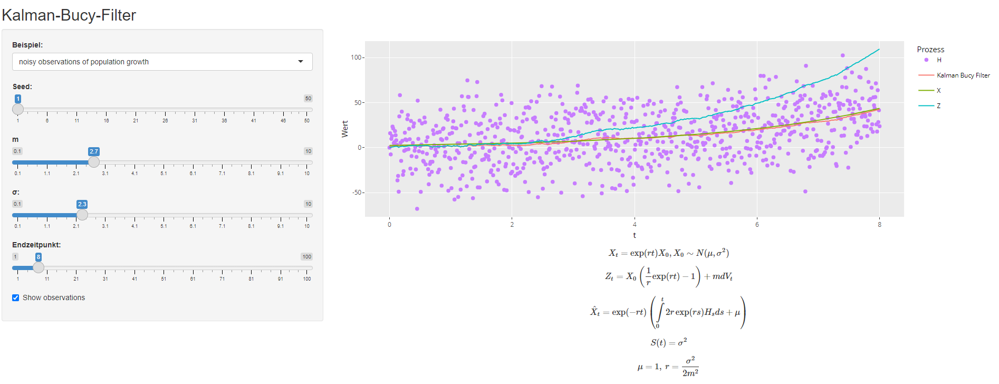

# Kalman-Bucy Filter

This repository contains a simple R Shiny app simulating the one-dimensional Kalman-Bucy filter - a continuous-time model for adjusting predictions of dynamic, noisy environments in real-time.

See Kalman_Bucy_Filter_Handout.pdf for my short notes or [[1]](#1) for all technical details.

## Applications

The Kalman-Bucy filter and its discrete-time-version, the Kalman filter, have been used for navigation of the Apollo Lunar Module [[2]](#1) and many other applications [[3]](#3).

## References

<a id="1">[1]</a> 
[Øksendal, B. (2003). Stochastic Differential Equations, 85-104](https://doi.org/10.1007/978-3-642-14394-6_5)

<a id="2">[2]</a> 
[Suddath, J. H., Kidd, R. H. III, & Reinhold, A. G. (1967). A Linearized Error Analysis of Onboard Primary Navigation Systems for the Apollo Lunar Module, NASA TN D-4427. National Aeronautics and Space Administration.](https://ntrs.nasa.gov/api/citations/19670025568/downloads/19670025568.pdf)

<a id="3">[3]</a> 
[Wikipedia: Kalman filter](https://en.wikipedia.org/wiki/Kalman_filter)
